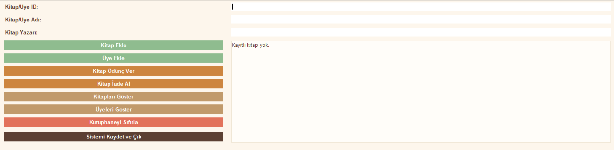
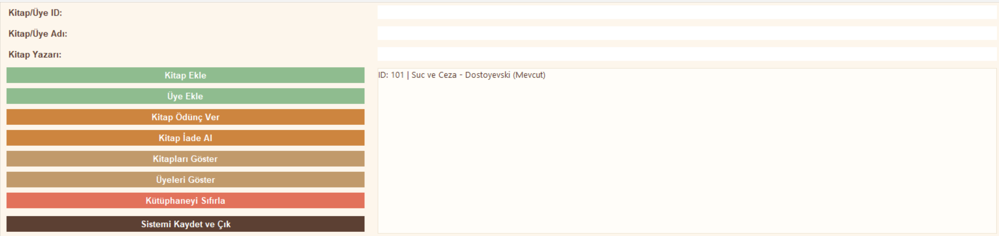
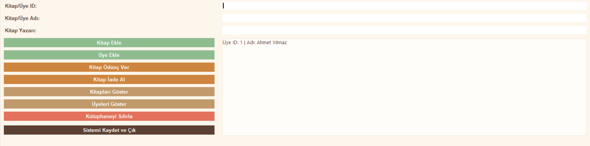
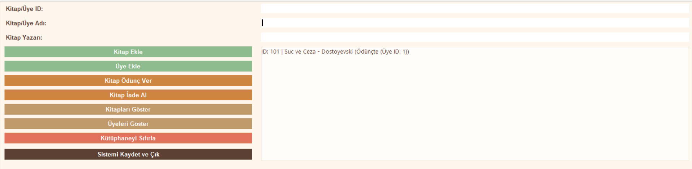

# Kütüphane Yönetim Sistemi
Python ve Tkinter kullanılarak geliştirilmiş kütüphane yönetim uygulaması.

## Proje Hakkında

Kütüphane Yönetim Sistemi, Python programlama dili kullanılarak geliştirilmiş bir masaüstü uygulamasıdır. Proje, kütüphanelerde kitap ve üye yönetimini kolaylaştırmak amacıyla hazırlanmıştır. Kullanıcılar sisteme kitap ve üye ekleyebilir, kitapları listeleyebilir, ödünç verme ve iade işlemlerini gerçekleştirebilirler.

Proje, Nesne Yönelimli Programlama (OOP) kullanılarak geliştirilmiş olup veriler JSON dosyasında saklanmaktadır.

## Özellikler

* Kitap ekleme
* Kitapları listeleme
* Üye ekleme
* Üyeleri listeleme
* Kitap ödünç verme
* Kitap iade alma
* Verileri JSON dosyasına kaydetme
* Program açıldığında kayıtlı verileri yükleme
* Tkinter tabanlı grafiksel kullanıcı arayüzü


## Proje Yapısı

```text
KUTUPHANE SISTEMI
├── main.py
├── kutuphane.py
├── kitap.py
├── uye.py
├── veri.json
└── arayuz.py
```

## Kurulum

1. Python 3'ün bilgisayarınızda kurulu olduğundan emin olun.

```bash
python --version
```

2. Proje dosyalarını bilgisayarınıza indirin.

3. Proje klasörünü VS Code veya başka bir Python geliştirme ortamında açın.

4. Uygulamayı çalıştırın.

Konsol sürümü için:

```bash
python main.py
```

Tkinter arayüzü için:

```bash
python arayuz.py
```

## Kullanım

1. Programı çalıştırın.
2. Kitap bilgilerini girerek yeni kitap ekleyin.
3. Üye ekleme işlemlerini gerçekleştirin.
4. Kitapları ödünç verin veya iade alın.
5. Veriler otomatik olarak JSON dosyasında saklanacaktır.

## Örnek Kullanım Senaryosu

* ID: 101 olan "Suç ve Ceza" kitabı sisteme eklenir.
* ID: 1 olan "Ahmet Yılmaz" isimli üye sisteme kaydedilir.
* Kitap üyeye ödünç verilir.
* İade işlemi gerçekleştirildiğinde kitabın durumu tekrar "Mevcut" olarak güncellenir.

## Ekran Görüntüleri






Akis Diyagrami: [Kütüphane Sistemi](Diyagram.png)


